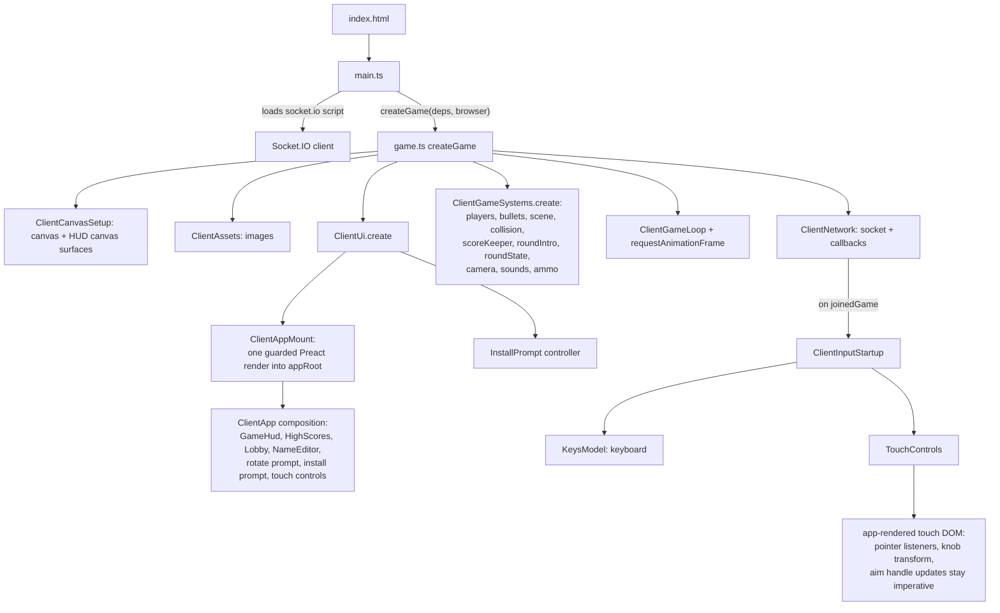

# Architecture: State And Control Flow

This document maps who owns state, who controls whom, and who constructs whom,
from the server down to the client components. Companion documents:
`documentation/State-ownership.md` (the state split) and
`documentation/UI-ownership.md` (the component boundary and per-frame
rendering rule).

## The Layers

```
┌─────────────────────────────────────────────────────────────────┐
│ SERVER (authoritative for sessions and slow lifecycle)          │
│ server.js → lobby.ts, gfmodel.ts, highScores.ts                 │
│ owns: matchmaking, names, slots, ready flags, phase, match      │
│       clock, scenario selection, round number, score, high scores│
└───────────────────────────┬─────────────────────────────────────┘
                            │ Socket.IO events (both directions)
┌───────────────────────────┴─────────────────────────────────────┐
│ CLIENT RUNTIME (game.ts orchestration, client-authoritative     │
│ gameplay)                                                       │
│                                                                 │
│  ClientNetwork ──▶ flow modules ──▶ client state                │
│                        │   (round state, model copy, input)     │
│  game loop (60fps) ────┤                                        │
│                        ▼                                        │
│                   view models (pure functions)                  │
│                        │ render props                           │
│            ┌───────────┴───────────┐                            │
│            ▼                       ▼                            │
│  CANVAS ENGINE (imperative)   PREACT APP ROOT                   │
│  scene, players, bullets,     lobby, high scores, name editor,  │
│  collision, joystick/aim      game HUD including ammo, touch    │
│  pointer math                 lobby buttons, gameplay markup    │
│            ▲                       │ action callbacks           │
│            └───────────────────────┘ (back into flows/input)    │
└─────────────────────────────────────────────────────────────────┘
```

## Client Source Folders

Client modules are grouped by the architecture boundary they belong to:

- `client/src/runtime/` — startup orchestration, dependency wiring, game loop
  construction, and runtime system factories.
- `client/src/ui/` — the single Preact app root, component screens, HUD/lobby
  view models, install prompt controller, and DOM/HUD UI render orchestration.
- `client/src/engine/` — imperative canvas gameplay objects and render helpers:
  players, bullets, scene, camera, collision, obstacles, scenarios, ammo,
  score, and round intro state.
- `client/src/flows/` — side-effect orchestration between state, engine,
  network, input, UI, and timers.
- `client/src/input/` — keyboard, touch controls, touch-interface state, and
  name-editor input model.
- `client/src/network/` — Socket.IO client wiring and synchronization helpers
  for public models, positions, model-update plans, and obstacle damage.
- `client/src/platform/` — browser/platform adapters and shared utilities:
  config, canvas setup/tools, assets, audio, identity storage, drawing helpers,
  and animation-frame scheduling.
- `client/src/state/` — framework-independent state utilities and shared client
  state enums such as screens, round state, and timers.

## Server: What It Owns And Emits

`server/server.js` constructs Express, Socket.IO, and the three game modules,
and validates `scenarios.json` / `rocks.json` at startup.

- `lobby.ts` — pairs sockets into games, sanitizes names, assigns slots, and
  projects compatibility status/message values from the game model.
- `gfmodel.ts` — the public game model: clients, ready flags, lifecycle phase,
  model version, phase timing, match clock, scenario, round number, match
  state, and scores.
- `highScores.ts` — in-memory high score table.

The server is authoritative for session state and low-frequency lifecycle
state. It is still a relay for high-frequency gameplay events and never
simulates movement or bullets.

| Direction       | Events                                                                                                                        |
| --------------- | ----------------------------------------------------------------------------------------------------------------------------- |
| Server → client | `joinedGame`, `newClient`, `leftGame`, `modelUpdate`, `highScores`, relayed `keyEvent` / `playerPosition` / `obstacleDamage`  |
| Client → server | `updateName`, `leaveGame`, `requeue`, `clientReady`, `roundResult`, outgoing `keyEvent` / `playerPosition` / `obstacleDamage` |

## Client Construction: Who Creates Whom



`main.ts` builds the typed dependency bag (`ClientRuntimeDependencies`) in one
place and injects `document`, `window`, and `Image` so startup stays testable.
`createGame` constructs everything else and is the only orchestrator; modules
do not construct each other sideways.

## Runtime Control Flow: Who Controls Whom


The control rules, in one list:

1. **The server controls sessions.** Clients never decide who is in a game,
   what anyone is named, what lifecycle phase is active, what the score is, or
   what the round number is. They send intents or reports (`clientReady`,
   `roundResult`, `requeue`, `leaveGame`, `joinLobby`, and `updateName`) and the
   server broadcasts the accepted result via `modelUpdate`.
2. **The game loop controls time.** `ClientGameLoop` fires
   `ClientFrameFlow.update` then `.render` every animation frame. Everything
   that happens per frame is reachable only from there.
3. **Flow modules control side effects and sequencing.** They decide when to
   render, when round phases transition (legal transitions live in
   `ClientScreens`), when sounds play, and when socket events are sent.
4. **View models control derivation only.** Pure functions from state to
   render props. No framework imports, no side effects.
5. **The Preact app controls DOM markup only.** Render props in, action
   callbacks out. `ClientAppMount` skips virtual-DOM work when props are
   value-equal, so Preact does nothing on steady-state frames.
6. **The canvas engine and touch pointer math stay imperative.** Simulation,
   drawing, and joystick/aim/fire pointer handling stay outside the component
   tree. The game HUD, including ammo indicators, renders as DOM from plain
   flow/view-model props.

## Gameplay Synchronization Model

Gameplay movement and hit detection are client-authoritative and peer-relayed.
Each client simulates locally; key events, periodic positions, and obstacle
damage are relayed through the server to the opponent. The winning client
reports `roundResult`; the server accepts only current, non-duplicate,
winner-owned results during the server `playing` phase and updates the
authoritative score. The server owns the match clock, hit-pause expiry,
next-round scenario switch, game-over transition, and high-score result source.
The remaining divergence risk is documented in
`documentation/State-ownership.md`.
