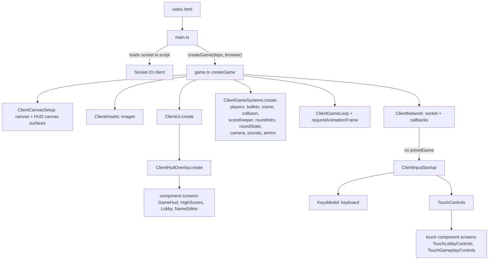
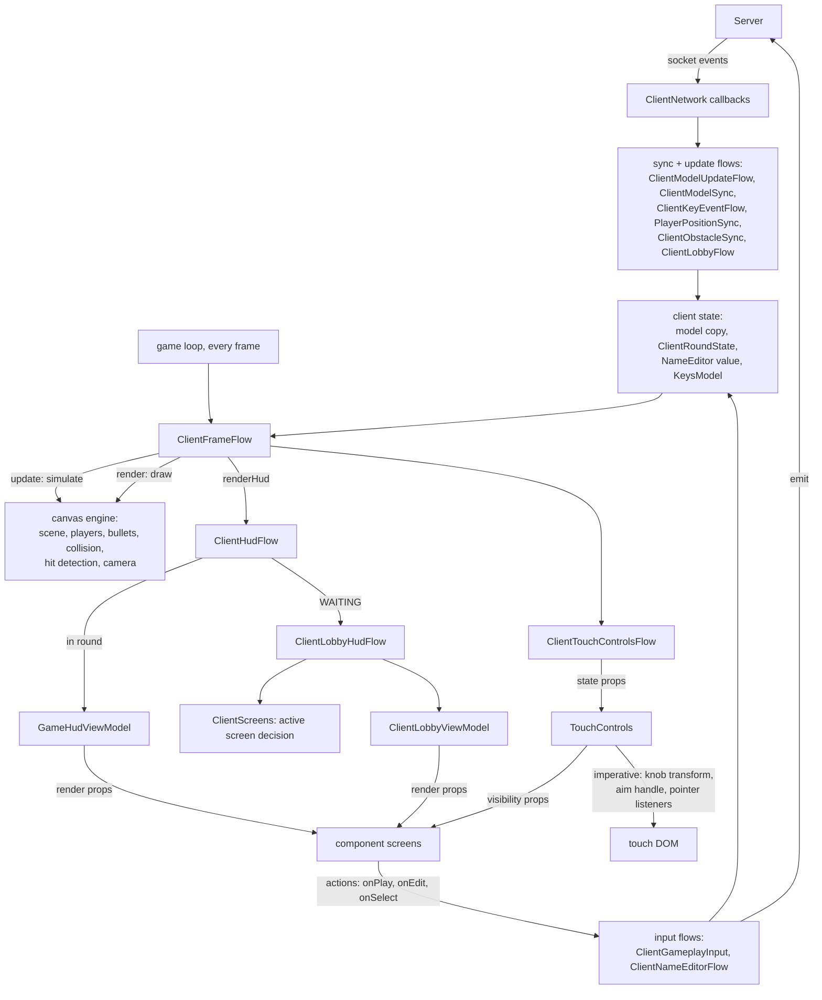

# Architecture: State And Control Flow

This document maps who owns state, who controls whom, and who constructs whom,
from the server down to the client components. Companion documents:
`documentation/State-ownership.md` (the state split) and
`documentation/UI-ownership.md` (the component boundary and per-frame
rendering rule).

## The Layers

```
┌─────────────────────────────────────────────────────────────────┐
│ SERVER (authoritative for sessions)                             │
│ server.js → lobby.ts, gfmodel.ts, highScores.ts                 │
│ owns: matchmaking, names, slots, ready flags, game status,      │
│       scenario selection, round number, high scores             │
└───────────────────────────┬─────────────────────────────────────┘
                            │ Socket.IO events (both directions)
┌───────────────────────────┴─────────────────────────────────────┐
│ CLIENT RUNTIME (game.ts orchestration, client-authoritative     │
│ gameplay)                                                       │
│                                                                 │
│  ClientNetwork ──▶ flow modules ──▶ client state                │
│                        │   (round state, model copy, input)     │
│  game loop (60fps) ────┤                                        │
│                        ▼                                        │
│                   view models (pure functions)                  │
│                        │ render props                           │
│            ┌───────────┴───────────┐                            │
│            ▼                       ▼                            │
│  CANVAS ENGINE (imperative)   PREACT COMPONENT SCREENS          │
│  scene, players, bullets,     lobby, high scores, name editor,  │
│  collision, ammo HUD,         game HUD, touch lobby buttons,    │
│  joystick/aim pointer math    touch gameplay markup             │
│            ▲                       │ action callbacks           │
│            └───────────────────────┘ (back into flows/input)    │
└─────────────────────────────────────────────────────────────────┘
```

## Server: What It Owns And Emits

`server/server.js` constructs Express, Socket.IO, and the three game modules,
and validates `scenarios.json` / `rocks.json` at startup.

- `lobby.ts` — pairs sockets into games, sanitizes names, assigns slots.
- `gfmodel.ts` — the public game model: clients, status, scenario, round
  number.
- `highScores.ts` — in-memory high score table.

The server is authoritative for session state and is a relay for gameplay
events. It never simulates gameplay.

| Direction       | Events                                                                                                                                                     |
| --------------- | ---------------------------------------------------------------------------------------------------------------------------------------------------------- |
| Server → client | `joinedGame`, `newClient`, `leftGame`, `modelUpdate`, `highScores`, relayed `keyEvent` / `playerPosition` / `obstacleDamage`                               |
| Client → server | `updateName`, `leaveGame`, `requeue`, `clientReady`, `resetReady`, `advanceRound`, `gameResult`, outgoing `keyEvent` / `playerPosition` / `obstacleDamage` |

## Client Construction: Who Creates Whom



`main.ts` builds the typed dependency bag (`ClientRuntimeDependencies`) in one
place and injects `document`, `window`, and `Image` so startup stays testable.
`createGame` constructs everything else and is the only orchestrator; modules
do not construct each other sideways.

## Runtime Control Flow: Who Controls Whom



The control rules, in one list:

1. **The server controls sessions.** Clients never decide who is in a game,
   what anyone is named, or what the round number is. They request
   (`clientReady`, `advanceRound`) and the server broadcasts the result via
   `modelUpdate`.
2. **The game loop controls time.** `ClientGameLoop` fires
   `ClientFrameFlow.update` then `.render` every animation frame. Everything
   that happens per frame is reachable only from there.
3. **Flow modules control side effects and sequencing.** They decide when to
   render, when round phases transition (legal transitions live in
   `ClientScreens`), when sounds play, and when socket events are sent.
4. **View models control derivation only.** Pure functions from state to
   render props. No framework imports, no side effects.
5. **Component screens control DOM markup only.** Render props in, action
   callbacks out. They skip virtual-DOM work when props are value-equal, so
   Preact does nothing on steady-state frames.
6. **The canvas engine and touch pointer math stay imperative.** Simulation,
   drawing, joystick/aim/fire pointer handling, and the ammo HUD never enter
   the component tree.

## Gameplay Synchronization Model

Gameplay is client-authoritative and peer-relayed. Each client simulates
locally; key events, periodic positions, and obstacle damage are relayed
through the server to the opponent. At game over the client submits
`gameResult` and the server records high scores. The known divergence risk is
documented in `documentation/State-ownership.md`.
