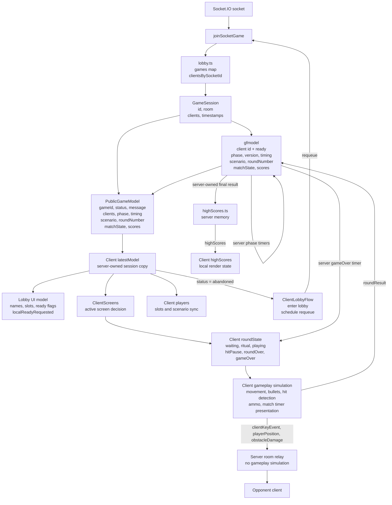
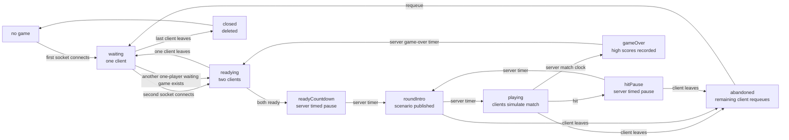

# Connection state model and ownership

Users come and go to the server. Therefore it is important that we have a clear model of how to handle connection, disconnect, pairing with opponent and readiness to play and all the other state objects and variables that is involved in producing the game.

This is an attempt to write down how the state is handled today, under AS IS, and how we would like it to be when it is robust and nice under TO BE IN A PERFECT WORLD

This document aims to describe this, in the simplest clearest way by describing how it is modeled in data and structures and the rules and events that govern the change in the model:

## AS IS

The server owns connection, pairing, names, ready flags, lifecycle phase,
projected game status, phase timing, match clock, scenario selection, round
number, match state, accepted round results, match score, and the final
high-score result source. The browser owns the active screen, local
presentation round phase, input state, player movement, bullets, hit detection,
obstacle damage, ammo, and match timer presentation.

The server does not simulate gameplay. It creates sessions, publishes the
public model, and relays gameplay events inside one game room.

### Visual model

### Server data

`server/gameModules/lobby.ts` owns the live session list.

Each `GameSession` has:

- `id`: public game id such as `G0001`.
- `room`: Socket.IO room name such as `game:G0001`.
- `model`: one `gfmodel` instance for this session.
- `clients`: the sockets currently in this session.
- `createdAt` and `updatedAt`.

Each lobby client has:

- `id`: player id allocated by `gfmodel`.
- `socketId`: current Socket.IO socket id.
- `gameId`: owning game id.
- `name`: sanitized unique display name.
- `ready`: readiness flag allocated and mutated by `gfmodel`.

`server/gameModules/gfmodel.ts` owns the small public game model inside a
session:

- list of model clients: `id` and `ready`
- lifecycle `phase`: `waiting`, `readying`, `readyCountdown`, `roundIntro`,
  `playing`, `hitPause`, `gameOver`, `abandoned`, or `closed`
- monotonically increasing `version`
- `phaseStartedAt` and optional `phaseEndsAt`
- optional authoritative `matchEndsAt`
- current scenario
- `roundNumber`
- `matchState`: `idle`, `playing`, or `gameOver`
- current match `scores`
- optional `matchResultId` after the server finishes a match

The public model sent to clients is built from the `gfmodel` snapshot plus
lobby-owned socket metadata:

- `gameId`
- `status`
- `message`
- `playerLimit`
- `clients`: `id`, `name`, `ready`, `slot`
- `phase`, `version`, `phaseStartedAt`, and optional `phaseEndsAt`
- `matchEndsAt` while a match is active
- `currentScenario`
- `matchState`
- `matchResultId` when a match has been finalized
- `roundNumber`
- `scores`

### Server phase and status rules

`gfmodel` owns lifecycle `phase`. `lobby.ts` projects the older `status` field
for UI compatibility:

- `waiting` phase maps to `waiting` status.
- `readying` and `readyCountdown` phases map to `readying` status.
- `roundIntro`, `playing`, `hitPause`, and `gameOver` phases map to `playing`
  status.
- `abandoned` and `closed` phases map to matching statuses.

`waiting` means a game exists with one connected client and room for another.

`readying` means two clients are paired. The clients may both be unready or one
ready.

`ready` is only valid while two clients are connected. A lone waiting client
cannot become ready.

`readyCountdown` means both clients are ready and the server is holding the
lobby screen briefly before starting the match.

`roundIntro` means the server has selected the scenario and round number; the
clients present `GET READY`, intro walking, and `DRAW!`.

`playing` means the duel is active and the server accepts current-round hit
results.

`hitPause` means an accepted hit is being shown. The server has already awarded
the point, but it has not yet advanced the scenario or round number.

`gameOver` means the server match clock has expired and the server-owned final
score has been recorded.

`abandoned` means a client left during an active match phase. The remaining
client receives an abandoned model.

`closed` means the last client left. Closed games are removed from the lobby
map.

Legal server phase transitions are:

| From             | To                                              |
| ---------------- | ----------------------------------------------- |
| `waiting`        | `readying`, `closed`                            |
| `readying`       | `waiting`, `readyCountdown`, `closed`           |
| `readyCountdown` | `roundIntro`, `abandoned`, `closed`             |
| `roundIntro`     | `playing`, `gameOver`, `abandoned`, `closed`    |
| `playing`        | `hitPause`, `gameOver`, `abandoned`, `closed`   |
| `hitPause`       | `roundIntro`, `gameOver`, `abandoned`, `closed` |
| `gameOver`       | `waiting`, `readying`, `abandoned`, `closed`    |
| `abandoned`      | `closed`                                        |
| `closed`         | none                                            |

When a disconnect leaves fewer than two clients, `gfmodel` clears the remaining
client's `ready` flag. If the disconnect happens during an active match phase,
the phase becomes `abandoned`; otherwise the remaining game returns to
`waiting`.

There should not be two separate one-player `waiting` games. After a leave or
disconnect creates a one-player `waiting` game, the server looks for another
one-player `waiting` game. If one exists, the server moves one waiting socket
into the other game, sends that moved socket a fresh `joinedGame`, and emits the
paired model to the target room. The moved client receives a new game id/player
id just as it would during a normal requeue. Both clients remain unready.

Only single-client `waiting` games are eligible for automatic pairing. The
server does not move clients out of active match or `abandoned` games.

### Connection and pairing lifecycle

On socket connection:

1. The server reads a proposed name from the Socket.IO handshake.
2. The lobby finds the first `waiting` game with room, or creates a new game.
3. The socket joins the game room.
4. The server emits `joinedGame` to the socket with its `gameId`, `playerId`,
   `slot`, resolved name, and the public model.
5. The server emits `newClient` to the other socket in the room if this was a
   new join.
6. The server emits the current high score table to the new socket.

On disconnect or explicit leave:

1. The lobby removes the socket client from its game and from `gfmodel`.
2. `gfmodel` clears remaining ready flags if fewer than two clients remain.
3. If no clients remain, the game becomes `closed` and is deleted.
4. If the game was in an active match phase, it becomes `abandoned`.
5. Otherwise the phase returns to the connection-count state.
6. If a model still exists, the server emits `modelUpdate` to the remaining
   room.
7. If the remaining game is a one-player `waiting` game and another one-player
   `waiting` game exists, the server automatically pairs those waiting players.

On `requeue`, or `leaveGame` with rejoin requested, the server removes the
socket from its current game and immediately joins it to a waiting or new game
using the same resolved name.

On `updateName`, the server sanitizes the requested name, makes it unique inside
the current game, stores it on the lobby client, and emits `modelUpdate`.

### Readiness and round selection

The client emits `clientReady` when the player presses play. The client only
offers this action when a connected opponent exists.

The server handles `clientReady` by asking `gfmodel` to set that client's
`ready` flag. `gfmodel` rejects the request when fewer than two clients are
connected. When the second client becomes ready, `gfmodel` resets the match
score and enters `readyCountdown` with a server `phaseEndsAt`. A server timer
then starts the match, sets `matchEndsAt`, advances the scenario, increments
`roundNumber`, enters `roundIntro`, and emits `modelUpdate`.

The browser starts the local round ritual when it receives a server model whose
phase enters `roundIntro`. The client still presents `GET READY`, `DRAW!`, intro
walking, sounds, and animation locally.

After game over, the server keeps the `gameOver` phase visible until its
`phaseEndsAt`, then clears every client's `ready` flag in `gfmodel`, resets
match state, returns the phase to `readying` or `waiting`, and emits
`modelUpdate`. The legacy client `resetReady` event is only a compatibility
request; it cannot reset the match before the server-owned game-over phase has
expired.

After a hit, only the winning client emits `roundResult`. The server accepts the
result only when the reporting socket is the winner, the game is `playing`, the
reported round is current, both players are still connected, and the result has
not already been accepted. The server increments the winner's score, enters
`hitPause`, and emits `modelUpdate`. The server does not
advance the scenario or `roundNumber` until the hit-pause timer expires. The
browser still owns the animation, sound, hit text, and responsive presentation.

When the server match clock expires, the server finishes the match once, sets
`matchState` to `gameOver`, records high scores from the server-owned final
score, and emits the updated model and high-score table. The legacy
`matchExpired` client event is accepted only as a request; the server clock
decides whether the match may actually end.

### Mutating socket events

| Event            | Direction                | Server action                                                                       |
| ---------------- | ------------------------ | ----------------------------------------------------------------------------------- |
| `joinLobby`      | client to server         | Join this socket to a waiting or new game.                                          |
| `updateName`     | client to server         | Sanitize and store the client's name; emit `modelUpdate`.                           |
| `leaveGame`      | client to server         | Remove the socket from the game; optionally rejoin.                                 |
| `requeue`        | client to server         | Leave the current game and join a waiting or new game.                              |
| `clientReady`    | client to server         | Mark the client ready only when paired; enter `readyCountdown` when both are ready. |
| `resetReady`     | client to server         | Legacy compatibility request; accepted only after the server game-over timer ends.  |
| `roundResult`    | client to server         | Accept one current-round result during `playing`, score it, and enter `hitPause`.   |
| `matchExpired`   | client to server         | Legacy expiry request; server finalizes only when its own match clock has expired.  |
| `clientKeyEvent` | client to server to peer | Relay keyboard/input event to the opponent.                                         |
| `playerPosition` | client to server to peer | Relay local player position to the opponent.                                        |
| `obstacleDamage` | client to server to peer | Relay validated obstacle damage to the opponent.                                    |

### Client state

The browser stores the latest public model from the server as `latestModel`.
That model gives the client:

- its own `playerId`
- the current client list, names, slots, and ready flags
- game status and lobby message
- current scenario
- lifecycle phase, model version, phase timing, match clock, match state, and
  score
- round number

The browser also has local state that is not in the public server model:

- `roundState`: `waiting`, `ritual`, `playing`, `hitPause`, `roundOver`,
  or `gameOver`
- input key state
- local optimistic `localReadyRequested`
- active screen and name editor state
- player positions, animation frames, aim, and facing
- bullets and ammo
- obstacle damage
- local display copy of the server-owned score
- match timer presentation and presentation timers
- high scores received from the server

`localReadyRequested` is set immediately after the local player presses play.
This makes the lobby UI respond before the authoritative `modelUpdate` returns.
It is cleared when the next model says the local client is not ready.

### Client screen and round model

The active screen is derived locally:

- any non-`waiting` round state shows `Game`
- `waiting` plus active name editor shows `Lobby-edit-name`
- `waiting` plus explicit high-score navigation shows `High-scores`
- otherwise `Lobby-main`

Legal local round transitions live in `client/src/state/clientScreens.ts`.
Server `phase` is not the same as client `roundState`. The client `roundState`
is presentation state that follows server phase updates.

### Gameplay synchronization

Gameplay is client-authoritative and peer-relayed through the server.

The local browser applies local input immediately. It then emits
`clientKeyEvent`, `playerPosition`, and `obstacleDamage` to the server. The
server validates the payload enough to attach or check the owning player id and
relays the event to the other socket in the same room.

The server does not decide:

- player movement
- bullet simulation
- hit detection
- ammo use
- obstacle collision

The server does decide whether to accept a reported round result, how the match
score changes, when hit pause ends, when the next scenario starts, when the
match clock expires, and which final score is recorded for high scores.

### Abandoned games

If a player leaves during an active match phase, the server marks the game
`abandoned` and sends a model update to the remaining player. The remaining
client enters local lobby state, shows the abandoned/opponent-left state, and
schedules a `requeue` after the configured delay.

If a player leaves before `playing`, the remaining game returns to `waiting` and
the remaining player is no longer ready.

### Known weaknesses

- `status` is still present as a compatibility projection for existing UI
  logic. The authoritative lifecycle field is now server `phase`.
- Server `phase` and client `roundState` are related but separate state
  machines. The client follows server phase, but still owns presentation
  animation details.
- The game is mostly client-authoritative, so clients can diverge if timing,
  delivery, collision, or hit detection differs.
- `roundResult` is still based on client-side hit detection. The server rejects
  stale, duplicate, cross-game, and non-winner reports, but it does not validate
  bullet physics.
- There is no durable session store. Games and high scores live in server
  memory only.

## TO BE IN A PERFECT WORLD
