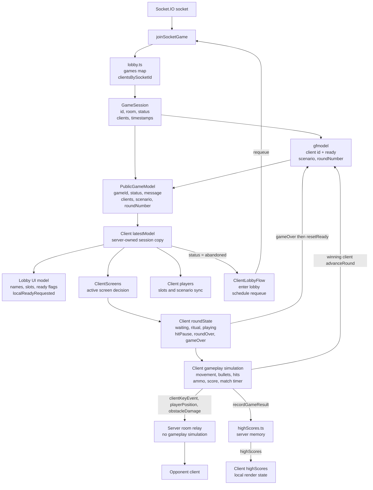
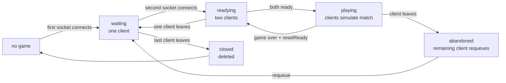

# Connection state model and ownership

Users come and go to the server. Therefore it is important that we have a clear model of how to handle connection, disconnect, pairing with opponent and readiness to play and all the other state objects and variables that is involved in producing the game.

This is an attempt to write down how the state is handled today, under AS IS, and how we would like it to be when it is robust and nice under TO BE IN A PERFECT WORLD

This document aims to describe this, in the simplest clearest way by describing how it is modeled in data and structures and the rules and events that govern the change in the model: 

## AS IS

The server owns connection, pairing, names, ready flags, game status, scenario
selection, and round number. The browser owns the active screen, local round
phase, input state, player movement, bullets, hits, obstacle damage, score, and
match timer.

The server does not simulate gameplay. It creates sessions, publishes the
public model, and relays gameplay events inside one game room.

### Visual model

### Server data

`server/gameModules/lobby.ts` owns the live session list.

Each `GameSession` has:

- `id`: public game id such as `G0001`.
- `room`: Socket.IO room name such as `game:G0001`.
- `status`: `waiting`, `readying`, `playing`, `abandoned`, or `closed`.
- `model`: one `gfmodel` instance for this session.
- `clients`: the sockets currently in this session.
- `createdAt` and `updatedAt`.

Each lobby client has:

- `id`: player id allocated by `gfmodel`.
- `socketId`: current Socket.IO socket id.
- `gameId`: owning game id.
- `name`: sanitized unique display name.
- `ready`: readiness flag allocated and mutated by `gfmodel`.

`server/gameModules/gfmodel.ts` owns the small public game model inside a
session:

- list of model clients: `id` and `ready`
- current scenario
- `roundNumber`

The public model sent to clients is built by merging `GameSession` state with
the `gfmodel` snapshot:

- `gameId`
- `status`
- `message`
- `playerLimit`
- `clients`: `id`, `name`, `ready`, `slot`
- `currentScenario`
- `roundNumber`

### Server status rules

`waiting` means a game exists with one connected client and room for another.

`readying` means two clients are paired. The clients may both be unready, one
ready, or both ready briefly before the server marks the game as `playing`.

`playing` means both clients reached ready at least once and the server has
broadcast the model that starts the match on the clients.

`abandoned` means a client left while the game was `playing`. The remaining
client receives an abandoned model.

`closed` means the last client left. Closed games are removed from the lobby
map.

Status is derived from connection count except for `playing`, `abandoned`, and
`closed`:

- zero clients: `closed`
- one client: `waiting`
- two clients: `readying`
- leave during `playing`: `abandoned`
- both clients ready: server calls `markPlaying`

### Connection and pairing lifecycle

On socket connection:

1. The server reads a proposed name from the Socket.IO handshake.
2. The lobby finds the first `waiting` game with room, or creates a new game.
3. The socket joins the game room.
4. The server emits `joinedGame` to the socket with its `gameId`, `playerId`,
   `slot`, resolved name, and the public model.
5. The server emits `newClient` to the other socket in the room if this was a
   new join.
6. The server emits the current high score table to the new socket.

On disconnect or explicit leave:

1. The lobby removes the socket client from its game and from `gfmodel`.
2. If no clients remain, the game becomes `closed` and is deleted.
3. If the game was `playing`, it becomes `abandoned`.
4. Otherwise the status is refreshed from the remaining client count.
5. If a model still exists, the server emits `modelUpdate` to the remaining
   room.

On `requeue`, or `leaveGame` with rejoin requested, the server removes the
socket from its current game and immediately joins it to a waiting or new game
using the same resolved name.

On `updateName`, the server sanitizes the requested name, makes it unique inside
the current game, stores it on the lobby client, and emits `modelUpdate`.

### Readiness and round selection

The client emits `clientReady` when the player presses play.

The server handles `clientReady` by setting that client's `ready` flag in
`gfmodel`. When the second client becomes ready, `gfmodel` advances the
scenario and increments `roundNumber`. The server then marks the session
`playing` and emits `modelUpdate`.

The browser starts gameplay when it receives a model with at least two ready
clients while its local round state is `waiting`. This starts the local round
ritual: `GET READY`, `DRAW!`, then `playing`.

The client emits `resetReady` after game over when it returns to the lobby. The
server clears every client's `ready` flag in `gfmodel`, refreshes session
status, and emits `modelUpdate`.

After a hit, only the winning client emits `advanceRound` during the hit reset.
The server increments `roundNumber`, advances the scenario, and emits
`modelUpdate`. The browser still owns the actual hit pause, scoring, reset, and
next-ritual timing.

### Mutating socket events

| Event | Direction | Server action |
| --- | --- | --- |
| `joinLobby` | client to server | Join this socket to a waiting or new game. |
| `updateName` | client to server | Sanitize and store the client's name; emit `modelUpdate`. |
| `leaveGame` | client to server | Remove the socket from the game; optionally rejoin. |
| `requeue` | client to server | Leave the current game and join a waiting or new game. |
| `clientReady` | client to server | Mark the client ready; start the server-side playing status when both are ready. |
| `resetReady` | client to server | Clear ready flags for all clients in the game. |
| `advanceRound` | client to server | Advance scenario and `roundNumber`. |
| `recordGameResult` | client to server | Record high scores and broadcast the table. |
| `clientKeyEvent` | client to server to peer | Relay keyboard/input event to the opponent. |
| `playerPosition` | client to server to peer | Relay local player position to the opponent. |
| `obstacleDamage` | client to server to peer | Relay validated obstacle damage to the opponent. |

### Client state

The browser stores the latest public model from the server as `latestModel`.
That model gives the client:

- its own `playerId`
- the current client list, names, slots, and ready flags
- game status and lobby message
- current scenario
- round number

The browser also has local state that is not in the public server model:

- `roundState`: `waiting`, `ritual`, `playing`, `hitPause`, `roundOver`,
  or `gameOver`
- input key state
- local optimistic `localReadyRequested`
- active screen and name editor state
- player positions, animation frames, aim, and facing
- bullets and ammo
- obstacle damage
- score and game-result recording state
- match timer and round timers
- high scores received from the server

`localReadyRequested` is set immediately after the local player presses play.
This makes the lobby UI respond before the authoritative `modelUpdate` returns.
It is cleared when the next model says the local client is not ready.

### Client screen and round model

The active screen is derived locally:

- any non-`waiting` round state shows `Game`
- `waiting` plus active name editor shows `Lobby-edit-name`
- `waiting` plus idle high-score rotation shows `High-scores`
- otherwise `Lobby-main`

Legal local round transitions live in `client/src/state/clientScreens.ts`.
Server `status` is not the same as client `roundState`.

### Gameplay synchronization

Gameplay is client-authoritative and peer-relayed through the server.

The local browser applies local input immediately. It then emits
`clientKeyEvent`, `playerPosition`, and `obstacleDamage` to the server. The
server validates the payload enough to attach or check the owning player id and
relays the event to the other socket in the same room.

The server does not decide:

- player movement
- bullet simulation
- hit detection
- ammo use
- score
- match timer expiry
- obstacle collision

At game over the client emits `recordGameResult`. The server records it in the
in-memory high score table and broadcasts the new table to all sockets.

### Abandoned games

If a player leaves during `playing`, the server marks the game `abandoned` and
sends a model update to the remaining player. The remaining client enters local
lobby state, shows the abandoned/opponent-left state, and schedules a `requeue`
after the configured delay.

If a player leaves before `playing`, the remaining game returns to `waiting`.

### Known weaknesses

- Session state and public model state are split between `lobby.ts` and
  `gfmodel.ts`. This works, but readiness lives inside `gfmodel` while status
  lives in `GameSession`.
- Server `status` and client `roundState` are related but separate state
  machines.
- The game is mostly client-authoritative, so clients can diverge if timing,
  delivery, collision, or hit detection differs.
- `advanceRound` is a client request and is not tied to a server-side gameplay
  validation.
- Game results are client-submitted.
- There is no durable session store. Games and high scores live in server
  memory only.

## TO BE IN A PERFECT WORLD
