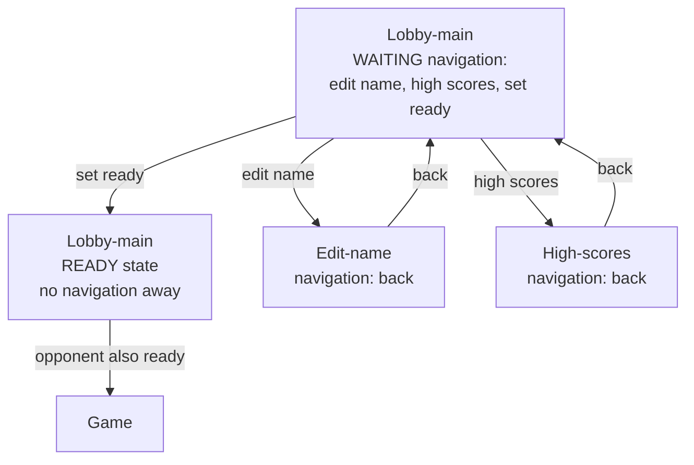

# Gunfight TODO3

## P2 - Lobby redesign

- [x] Earlier auto-rotation timing was replaced by explicit high-score navigation in P3.2.
- [x] Redesign the main lobby into a simpler arcade title screen.
    - [x] Remove the game ID from the main lobby.
    - [x] Remove the separate redundant local player name line.
    - [x] Keep `GUNFIGHT 1975` centered near the top.
    - [x] Show desktop controls in the center: movement, aim, and shoot.
    - [x] Show `PRESS E TO EDIT NAME` and `PRESS P TO PLAY` centered below the controls.
    - [x] Keep the player characters moving in the lobby background.
    - [x] Place each player's name and lobby state beneath their character.
    - [x] Make the name/state text follow the character while it moves.
    - [x] Show `READY` status as negative text.
    - [x] Keep each lobby character inside an invisible side-area so the character and following text stay readable and do not drift into the central lobby instructions.
    - [x] Make the local player obvious before movement starts, for example with a small `YOU` marker above the local character or a subtle local-only highlight around the local name.
    - [x] Keep lobby character labels symmetrical, with name and `WAITING` or `READY` beneath.
- [x] Do not show characters in the background on the high-scores-page.

## P2.1 - Lobby redesign follow up

- [x] Earlier idle high-score rotation was replaced by explicit high-score navigation in P3.2.
- [x] The High score screen should have column at the beginning called 'Place'. It should have the row text 1ST, 2ND, 3RD, 5TH, etc .. up to 10TH
- [x] Always show 10 high-score rows with place labels and no `NO SCORES YET` text.
- [x] I would like all the text to be real HTML text. Canvas text is blurry and the negative text looks inconsistent with html text. Can you make the html text follow the character
- [x] Should we adjust specifications with some of these design changes - to not have stale specs.

## P2.2 - Mobile phone quality assurance

- [x] The buttons for 'play' and 'edit name' are missing.

## P2.3 - Mobile high-score follow up

- [x] Do not show the mobile `EDIT NAME` and `PLAY GUNFIGHT` buttons on top of the high-score table.
- [x] On mobile, show only the top 5 high-score rows.
- [x] On mobile high scores, show the action buttons underneath the table.

GOAL: Make the lobby experience more clear and not confusing

## P3.1 - Clean up lobby identity on lobby screen

- [x] In the lobby labels, show only player names. Use `CAL`, not `PLAYER 2 - CAL`.
- [x] In the lobby only, render the local player on the left side and the opponent on the right side, independent of server slot/player id.
- [x] Keep gameplay slot, server slot, HUD placement, and scoring behavior unchanged.

## P3.2 - Clean up navigation - Remove auto time based navigation to High-score page

- [x] Navigation in lobby should follow this model on both mobile and desktop:

- [x] Once user sets status READY navigation away from lobby-main is removed! (remember mobile)
- [x] On mobile the three lobby-main buttons are stacked vertically
- [x] Navigation from edit-name and high-scores pages is simplified to just 'Back to lobby'
- [x] Navigation is done with buttons on mobile but with retro style keyboard keys on desktop
- [x] On desktop we should use key 'S' and the text 'PRESS S TO SEE HIGH SCORES' that takes you from main-lobby the high-score page.
- [x] On desktop we should use key 'S' and the text 'PRESS S TO RETURN TO LOBBY' to take you from the high-score page back to main lobby.
- [x] We should remove the automatic changing between lobby and high score. make sure we remove the fancy timing logic

## P3.2.5 - Improve 'No opponent' experience

- [x] When user is not paired with opponent show `LOOKING FOR OPPONENT`.
- [x] Recommended presentation:
    - Keep the local player on the left as today.
    - On the right lobby side, show a simple opponent placeholder instead of empty space.
    - Use a large `?` marker where the opponent avatar would be.
    - Show `LOOKING FOR OPPONENT` beneath the marker.
    - Keep it in the same right-side area that the opponent will occupy when matched, so the screen does not jump when an opponent arrives.
- [x] The placeholder should be lobby-only presentation state.
    - Do not create a fake opponent client in the server model.
    - Do not add a fake player to gameplay, scoring, ammo, or HUD state.
    - Prefer deriving it at the last lobby template/render-props layer from the absence of an opponent.
    - It should not change matchmaking, state modeling, player sync, slots, or canvas gameplay objects.
- [x] The real opponent always wins over the placeholder.
    - When an opponent client is present, render the real opponent exactly as today.
    - The placeholder should disappear as soon as an opponent client is present.
- [x] If the game is `abandoned`, prefer the abandoned/opponent-left message over the generic looking-for-opponent placeholder.

## P3.2.6 Mobile tweaks and edit name revert

- [x] Create a class to make a negative button. Yellow background with black text.
- [x] On Mobile, Make Play button the top button of the three to choose from. And make it a negative button.
- [x] There are some pointer-event:none missing in the mobile layout (see photo)
- [x] When editing name, start with the existing name prefilled (Like it used to be).

## P3.2.7 Even more tweaks - ammunition indicator, names in game

- [x] On mobile, the ammunition indicator is not visible. Consider making it DOM. Should be down in the bottom row.
- [x] I would like the name of the players on each side of the screen next to the score in the scoreRow. Symmetrical.

## P3.2.8 Mobile problems with starting new game after finishing one game.
- [ ] When mobile use completes one game, user is not able to play a second game. This is not a problem on Desktop. 
After completing the first game and returning to the lobby. The mobile user experiences that the user can not leave waiting state even if user is tapping play game button nothing happens. 

## P3.3 - State model review and future plans

- [ ] We should look into the current state model a come up with an improvement.
- [ ] We should look into if disconnect and re-connect are handled correct from mobile and desktop.
- [ ] How do we pair up players who have lost they opponent? Do we use alone players? or wait for their old opponents to reconnect.
- [ ] Should you be able to be in ready state when you have no opponent?

## P3.4 - After game users should see the new status

- [ ] After the game. Players should see the high score page for a period of time, before returning to main lobby.

# Backlog

## Sensible robust and not confusing and not ugly game

- [ ] When both players have marked themselves as ready - I would like a leave-lobby-for-game-sequence. I would like the lobby screen to keep the players in the lobby for a few seconds so you can see the READY status in negative text for 2 seconds and hear the ready sound before switching to the game screen.

- [ ] We should collect all game constants like this leave-lobby-pause-duration above in some central shared place.

- [ ] On Desktop, after a game. 'Game over' should continue to be shown in the main lobby as should the last game result in the top line.

## Content Authoring Tools

### Add a rock editor page.

- [ ] Add a rock editor page.
    - [ ] Provide a WYSIWYG preview for rock dimensions and polygon shape.
    - [ ] Accept rock JSON as input.
    - [ ] Output rock JSON for copying into project data.
    - [ ] Validate JSON and geometry with readable errors.

## Add a scenario editor page.

- [ ] Add a scenario editor page.
    - [ ] Provide a WYSIWYG preview of the full arena scenario.
    - [ ] Let the user place and adjust rocks, cacti, wagons, saloons, decorations, and player start positions.
    - [ ] Accept scenario JSON as input.
    - [ ] Output scenario JSON for copying into project data.
    - [ ] Validate JSON and scenario geometry with readable errors.

## Ideas

- [ ] Add persistent high scores with a database.
- [ ] Add private room codes.
- [ ] Add spectator mode.
- [ ] Add optional rematch flow.
- [ ] Add a small original story or Stranger Things-style twist.
- [ ] Add more sounds, animations, and scenario themes.
- [ ] Add the number of wins/kills after the name in the lobby: LUKE 5/10

## MAYBE Ideas
